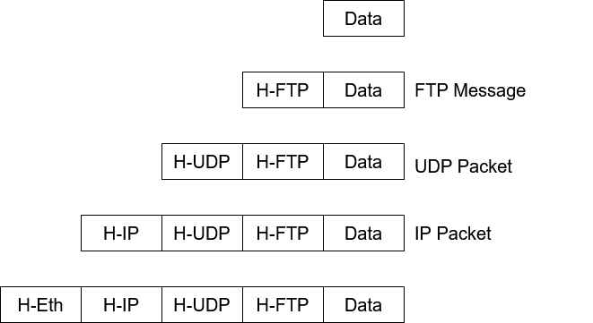

## 🛡️ Introduction to Ethical Hacking

### What is Ethical Hacking?
- Simulating hacker behavior to **identify vulnerabilities** in a legal and authorized way.
- Also known as:
  - Penetration Testing
  - Intrusion Testing
  - Red Teaming

### Ethical Hackers
- Employed by companies to perform penetration testing.

### Key Terms:

Penetration Testing

- Legal Attempt to break into the company's network or system to find the weak links  
- Tester only reports findings, does not provide solutions.

Security Testing

- Also includes analyzing company's security policy & procedures.  
- Tester offers solutions to rescue or protect the network or system.

Hacking
Showing computer expertise

Cracking
Breaching security on software or systems.

Spoofing
Faking the originating IP address in datagram.

<abbr title="Denial-of-Service">DoS</abbr>
Flooding a host to make it not responding.

Port Scanning
Searching for vulnerabilities.

### Common Techniques:
- **Front door access**: Guessing/stolen credentials.
- **Backdoor access**: Hidden developer access.
- **Trojan horses**: Malicious code hidden in software.
- **Software vulnerability exploitation**: Using unpatched flaws.

### Once Gained access, then the hacker can:
- Modify logs 
    - cover their tracks.
- Steal files
    - sometimes destroys after stealing
    - an expert hacker would steal & cover their tracks to remain undetected.
- Modify files
    - to let you know they were there
    - to cause mischief
- Indtall backdoors
    - so they can get in again
- Attack other systems

### The Role of Security Tester and Penetration Testers
1. **Script kiddies** or **pocket monkeys**
    - young or inexperienced hackers
    - copy codes & techniques from knowledgeable hackers
2. Experienced penetration tester
    - these testers write programs or scripts
    - In Perl, C, C++, Python, JS, VB, SQL, etc..

### Responsibilities of Ethical Hackers:
- Generate vulnerability reports
- Do not disrupt business operations
- Understand laws of the land

### Penetration Testing Methodologies:
- **White Box**: Full internal access.
- **Black Box**: No prior knowledge.
- **Grey Box**: Partial information.
- **Tiger Box**: A security testing approach combining elements of all three boxes.

### What we can do Legally
- Laws involving technology change as rapidly as technology itself.
- Find what is legal for you locally.
    - Laws change from place to place.
- Be aware of what is allowed and what is not allowed.

### Laws of Land
- Tools on your computer might be illegal to process
- Contact local law enforcement agencies before installing hacking tools
- Written words are open to interpretation
- Governments are getting more serious about punishment for cybercrimes.

### What we can not do legally
- Accessing a computer without permission is illegal
- Other illegal actions:
  - Installing worms or viruses
  - DoS attack
  - Denying users access to network resource

### Caution
- Our actions should enable customers to do their jobs without interruption.

---

## 🌐 Networking Basics
A communication System for connecting computer/hosts.

### Why Networking?
- Communication and resource sharing (e.g., cloud computing)
- Social networking and security systems

### Network Types:
- **LAN**: Small geographic area (fast, low cost)
- **WAN**: Large area (slow, costly)

### Data Transfer Methods:
1. **Circuit Switching**
  - Dedicated path between nodes
  - Constant bandwidth
  - Inefficient for bursty traffic (like web data)

2. **Packet Switching**
    - No reserved path
    - Data split into packets
    - Efficient for Internet-like communication
  - Data are transmitted in short packets
    - A longer message is broken up into smaller chunks.
    - The chunks are packets
    - Every packet contains a header \
  
  - Based on stored forward concept
    - Each intermediate node receives a whole packet.
    - Decides the route.
    - Forwards the packet along the selected route. \
  
  - **Advantages:**
    - Links can be shared; so link utilization is better.
    - Suitable for computer-generated traffic.
    - Buffering and data rate conversion can be performed easily.
    - Some packets may be given priority over others, if desired.

### How packets are transmitted?
- There are two different approaches:
  1. Virtual Circuits
  2. Datagram
#### Virtual Circuits
Similar to circuit switching, a route is established beforre transmission then all packets followe the same path.

#### Datagram Approach:
- Packets are routed independently
- May arrive **out of order**
- No connection setup needed

### Comparison of Transmission Techniques:
| Technique        | Setup Needed | Route Fixed | Dynamic | Suitable for |
|------------------|--------------|-------------|---------|---------------|
| Circuit Switching| Yes          | Yes         | No      | Voice calls    |
| Virtual Circuit  | Yes          | Yes         | No      | Controlled data |
| Datagram         | No           | No          | Yes     | Bursty data (Internet) |

### Delay Components:
- **Propagation Delay**: Time to travel medium
- **Transmission Delay**: Time to push bits
- **Processing Delay**: Router/switch processing time

### How data flows in OSI Model

### Internetworking Devices
- **Hub**: 
  - Extends the span of a single LAN.
- **Bridge(Layer 2 Switch)** :
  - Connects two or more LANs together.
  - Works at Data Link Layer.
- **Router(Layer 3 Switch)**:
  - Connects any combination of LANs & WANs.
  - Works at Network Layer

---

## 🏗️ TCP/IP Protocol Stack (Part I)

### Internet Standard: TCP/IP
- Foundation of the **Internet**
- Ensures compatibility across platforms (Windows, Linux, Mac)

### Layer Comparison: OSI vs TCP/IP

### TCP/IP Protocol Suite
- Refers to a family of protocols
- The protocols are built on top of connectionless technology (datagrams).
  - Data sent from one node to another as a sequence of datagrams.
  - Each datagram is sent independently.
  - The datagrams corresponding to the same message may followe different routes.

### TCP/IP Family Members (some of them)

- **Address Resolution Protocol(ARP)**: Maps IP address to hardware address.
- **Reverse ARP(RARP)**: Maps hardware address to IP address
- **Internet Control Message Protocol(ICMP)**: A network device can send error messages and other information.
- **Internet Group Management Protocol(IGMP)**: A node can send its multicast group membership to adjacent routers.

### Key Protocols:
- 3. [**IP**](#1-ip): Routing and addressing
- 1. [**TCP**](#2-tcp): Reliable, connection-oriented
- 2. [**UDP**](#3-udp): Fast, connectionless

### 1. IP 
- IP transports datagram from a source to destination
  - Responsible for routing the packets
  - Breaks a packet into smaller packets, if required.
  - Unreliable service
    - A packet may be last in transit
    - Packets may arrive out-of-order
    - Duplicate packets may be generated.

### 2. TCP
- TCP provides a connection-oriented, reliable service fro sending messages.
  - Split a message into packets.
  - Reassemble packets at destination
  - Resend packets that were lost in transit.
- Interface with IP
  - Each packet forwarded to IP for delivery.
  - Error control is done by TCP.

### 3. UDP
- UDP provides a connectionless, unreliable service for sending datagrams (packets).
  - Messages small enough to fit in a packet.
  - Simple than TCP.
  - Never split data into multiple packets.
  - Does not care about error control.
- Interface with IP.
  - Each UDP packet sent to IP for delivery.

### Encapsulation
- As data flows down the protocols hierarchy, headers get appended to it.\

---